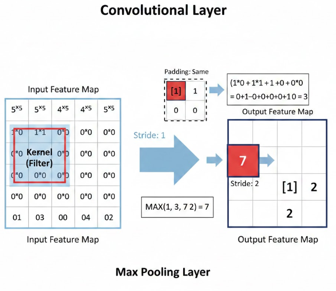

# Convolutional Neural Networks (CNNs)

## 1. Introduction

A Convolutional Neural Network (CNN) is a specialized deep learning
architecture designed to process grid-structured data such as images.
Unlike fully connected neural networks that flatten input into a single
vector, CNNs preserve spatial relationships by using convolutional
operations.

CNNs automatically learn hierarchical feature representations:

-   Low-level features: edges, gradients
-   Mid-level features: shapes, textures
-   High-level features: objects or patterns

------------------------------------------------------------------------

## 2. Core Architecture

### 2.1 Convolutional Layer

A convolutional layer applies a **kernel (filter)** that slides over the
input matrix.

Mathematically:

FeatureMap(i,j) = Σ(Input \* Kernel)

Key parameters:

-   **Stride** -- step size of filter movement
-   **Padding** -- adding zeros around input borders
-   **Number of filters** -- depth of output feature maps

### Visualization -- Convolution Output

------------------------------------------------------------------------

### 2.2 Activation Function (ReLU)

ReLU(x) = max(0, x)

It introduces non-linearity and prevents vanishing gradient problems.

------------------------------------------------------------------------

### 2.3 Pooling Layer

Pooling reduces spatial dimensions and computational complexity.

Most common: **Max Pooling**

------------------------------------------------------------------------

### 2.4 Fully Connected Layer

After convolution and pooling, feature maps are flattened into a vector
and passed into dense layers for final classification.

------------------------------------------------------------------------

## 3. CNN Workflow

1.  Input image
2.  Convolution
3.  ReLU
4.  Pooling
5.  Repeat blocks
6.  Flatten
7.  Dense layer
8.  Softmax classification

------------------------------------------------------------------------

## 4. Practical Cybersecurity Example

### Malware Detection Using CNN

In cybersecurity, CNNs can classify malware by transforming binary files
into grayscale images.

### Dataset Description

Example dataset structure:

-   malware/
-   benign/

Each file is converted to 64x64 grayscale image.

------------------------------------------------------------------------

## 5. Advantages of CNNs

-   Parameter sharing reduces overfitting
-   Automatic feature extraction
-   Translation invariance
-   Highly effective for image-based malware analysis

------------------------------------------------------------------------

## 6. Conclusion

CNNs are powerful deep learning architectures optimized for spatial
data. In cybersecurity, they enable automated malware classification,
intrusion detection visualization, and anomaly detection using
structured traffic representations.
